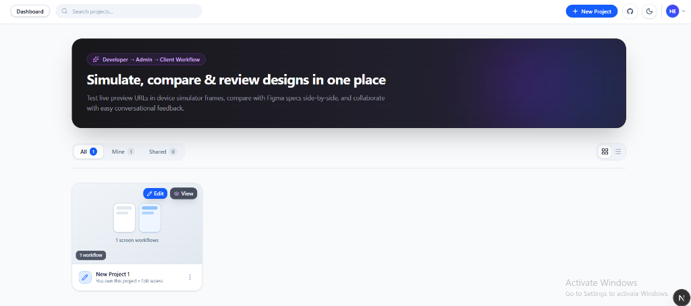
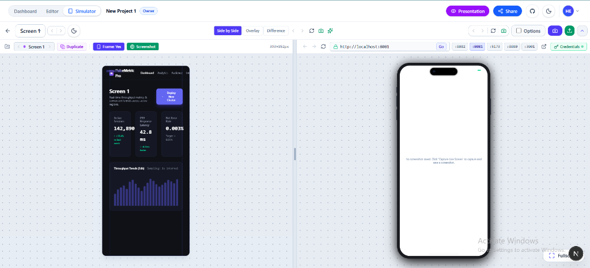
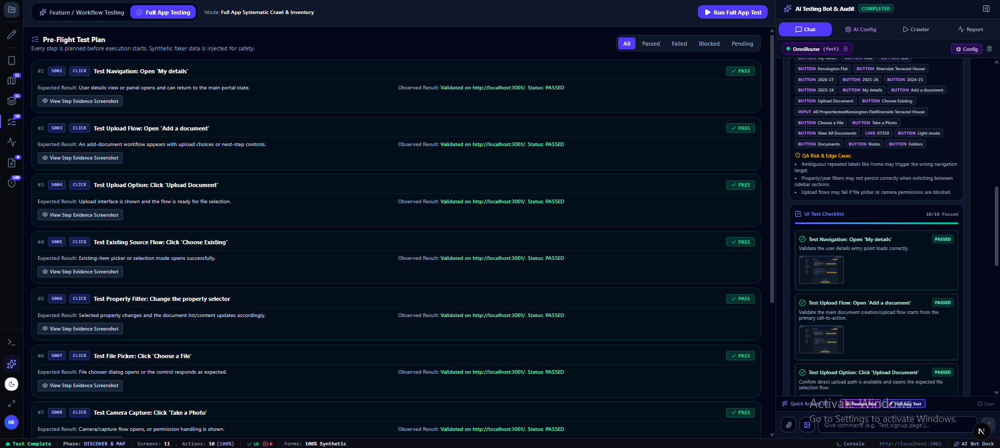
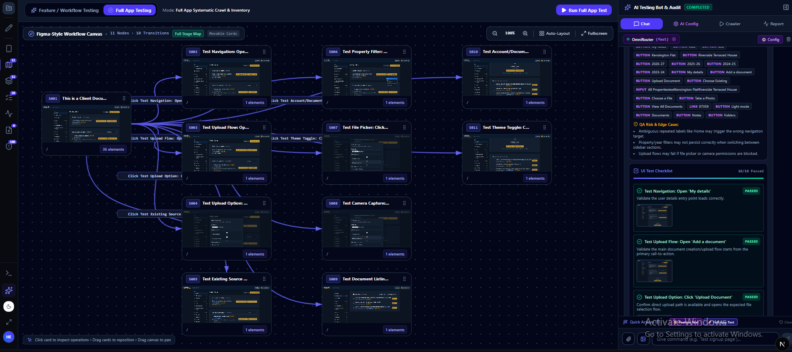
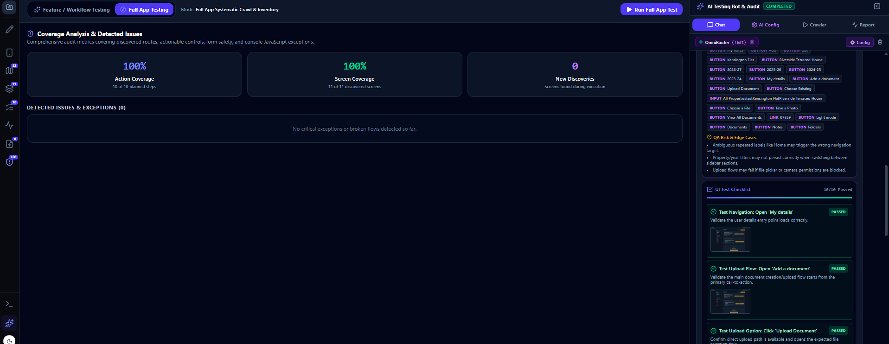

# 🎨 Open Design AI

> **Open-Source Design Review Platform & Autonomous Web Application Testing Simulator**  
> Streamline UI sign-offs with Figma comparisons, and automate systematic end-to-end application testing using autonomous AI browser agents.

[](LICENSE)
[](https://github.com/nareshbabunuli)
[](https://nextjs.org/)
[](https://www.typescriptlang.org/)
[](https://tailwindcss.com/)
[](https://supabase.com/)
[](CONTRIBUTING.md)

---

## 📸 Screenshots

### 🏠 Dashboard - Multi-Project Hub

*Organize client projects, track completion, manage team access, and launch presentation-ready reports.*

### 📱 Device Simulator - Figma vs Live

*Run live web URLs in responsive device frames side-by-side with your Figma design specs.*

### 🤖 AI Full App Testing

*AI bot crawls your entire app, generates a pre-flight test plan, executes every step, and reports pass/fail with evidence screenshots.*

### 🎨 Visual Flow Canvas

*Figma-style canvas of every discovered screen and navigation flow — auto-generated by the AI crawler.*

### 📊 Coverage Report

*Comprehensive coverage metrics: action coverage, screen coverage, detected issues, and QA risk edge cases.*

---

> [!NOTE]
> ### 📜 Open Source with Author Attribution & Anti-SaaS Protection
> This project is free and open source under the **MIT License with Commons Clause & Mandatory Attribution**.  
> - **Free to use & self-host**: You can freely use, run, and self-host this software for yourself, your team, and client engagements.
> - **Author credit required**: Any public deployment or fork must include visible, clickable attribution:  
>   *"Powered by Open Design AI by [Naresh Babu Nuli](https://github.com/nareshbabunuli/Design-Review)"*.
> - **Anti-SaaS Clause**: You may **not** take this codebase, rebrand it, and sell it as a commercial SaaS product or paid service to third parties.

---

## ⚡ What is Open Design AI?

This repository combines two core engineering solutions:

1. **Autonomous AI Testing Simulator** — A QA engine that systematically audits, maps, plans, and executes deep browser interactions on live web applications with visual proof.
2. **Design Review Platform** — A side-by-side design comparison and client approval workspace connecting Figma mockups with real production screens.

---

## 🤖 Pillar 1: Autonomous AI Testing Simulator

Traditional automated testing breaks when selectors change or auth redirects occur. The AI Simulator operates through two specialized testing paradigms:

### 🎯 AI Provider Compatibility

**Open Design AI supports multiple AI providers for maximum flexibility:**

| Provider | Type | Models Available | API Key Required | Best For |
|----------|------|------------------|------------------|----------|
| **OmniRouter** 🌟 | Multi-Provider Gateway | DeepSeek V4 Flash (free), GPT-5.5 (free), Gemini 2.0 Flash | Yes (free tier) | Recommended - Free flagship models |
| **OpenRouter** | Multi-Provider Gateway | Claude 3.5 Sonnet, GPT-4o, Llama 3.1 70B, 100+ models | Yes | Popular choice with wide model selection |
| **LLMA** | Inference API | LLMA 3.1 70B, LLMA 3.1 8B, LLMA 2 70B | Yes | Optimized large language models |
| **Local LLM** 🆓 | Self-Hosted | Llama 3.2, Mistral, CodeLlama, DeepSeek | No | Privacy & cost-free local inference via Ollama/LM Studio |
| **Custom** | Any OpenAI-Compatible API | Your choice | Optional | Connect any compatible endpoint |

**Configuration:**
```env
# Choose your AI provider
AI_PROVIDER=omnirouter  # or: openrouter, llma, local, custom
AI_BASE_URL=https://api.unorouter.com/v1
AI_API_KEY=your_api_key_here
AI_MODEL=deepseek-v4-flash:free
```

**Getting API Keys:**
- OmniRouter: [https://unorouter.com/token](https://unorouter.com/token) (free tier available)
- OpenRouter: [https://openrouter.ai/keys](https://openrouter.ai/keys)
- LLMA: [https://llma.io](https://llma.io)
- Local: Install [Ollama](https://ollama.ai) or [LM Studio](https://lmstudio.ai) (no key needed)

**Quick Setup Examples:**

<details>
<summary>🌐 OmniRouter (Recommended for beginners)</summary>

```env
AI_PROVIDER=omnirouter
AI_BASE_URL=https://api.unorouter.com/v1
AI_API_KEY=your_free_omnirouter_key
AI_MODEL=deepseek-v4-flash:free
```

Free tier includes flagship models with ~1 request/min rate limit per model. Rotate between models for higher throughput.
</details>

<details>
<summary>🔓 OpenRouter (Most model variety)</summary>

```env
AI_PROVIDER=openrouter
AI_BASE_URL=https://openrouter.ai/api/v1
AI_API_KEY=your_openrouter_key
AI_MODEL=anthropic/claude-3.5-sonnet
```

Access 100+ models from OpenAI, Anthropic, Google, Meta, and more.
</details>

<details>
<summary>🏠 Local Ollama (100% free, 100% private)</summary>

```bash
# Install Ollama
curl -fsSL https://ollama.ai/install.sh | sh

# Pull a model
ollama pull llama3.2

# Configure
AI_PROVIDER=local
AI_BASE_URL=http://localhost:11434/v1
AI_MODEL=llama3.2
```

No API key needed. Runs completely offline. Perfect for sensitive data.
</details>

<details>
<summary>⚡ LLMA (Optimized inference)</summary>

```env
AI_PROVIDER=llma
AI_BASE_URL=https://api.llma.io/v1
AI_API_KEY=your_llma_key
AI_MODEL=llma-3.1-70b
```

High-performance inference optimized for large language models.
</details>

---

### 1️⃣ Mode 1: Full App Systematic Testing (MAP & PLAN FIRST)
- **Automatic Screen Discovery**: Crawls reachable web pages, inspects Single Page Application (SPA) state tabs (`[role="tab"]`, `.tab`, nav triggers), and extracts complete actionable element inventories (inputs, dropdowns, toggles, file uploads, action buttons).
- **Figma-Style Visual Workflow Canvas**: Diagrams discovered screens, routes, and modal transitions into an interactive visual graph.
- **Pre-Flight Test Plan**: Automatically formulates structured test cases with synthetic test data before execution begins.
- **Systematic Step Execution**: Executes every action step-by-step with fault-tolerant multi-tier locators (CSS IDs, testids, aria labels, and semantic fuzzy text matching).
- **Dynamic New Discovery**: Automatically detects modals, drawers, or unmapped routes that open mid-test and dynamically inserts them into the test suite.
- **Visual Evidence & Reports**: Captures high-resolution screenshot proofs on every step with passing/failing verdicts and coverage metrics.

### 2️⃣ Mode 2: Targeted Feature / Workflow Testing
- **Natural Language Prompts**: Simply specify what to test: *"Test invoice creation flow"*, *"Test user signup and file upload"*, or *"Test forgot password and reset"*.
- **Autonomous Intent Decomposition**: The engine identifies starting points, goal criteria, required screens, and synthetic data needs without asking for code selectors.
- **Targeted Discovery**: Focuses crawling exclusively on the relevant user journey.
- **Edge Case Validation**: Automatically tests missing required fields, boundary values, invalid email formats, and unexpected UI states.

### 🛡️ Smart Autonomous Capabilities
- **Interactive Login Wall Detection**: Pauses automatically when encountering password fields, securely prompts for test credentials with persistence, logs in via Puppeteer, and transitions seamlessly to post-auth application mapping.
- **Single Page Application (SPA) Navigation**: Seamlessly explores complex React/Next.js single-page dashboards driven by state variables and tabs rather than URL changes.
- **Dummy File Generation**: Synthesizes in-memory images, PDFs, CSVs, and documents on the fly to test file upload controls.

---

## 🎨 Pillar 2: Design Review & Client Sign-off

Built specifically to stop endless revision loops and misaligned client expectations:

- **Side-by-Side Comparison** — Compare Figma frames directly against live application screenshots with interactive zoom and split sliders.
- **No-Login Client Sharing** — Share secure review links (Google Drive style). Clients leave structured feedback without creating an account.
- **Structured Feedback & Annotations** — Pin comments directly to specific UI regions.
- **Designer Reasoning Log** — Document *why* design decisions were made to prevent scope creep.
- **Approval Tracking** — Track approved vs pending screens in real time.
- **Client Presentation Slides & PDF Export** — Generate clean pitch decks and sign-off reports with a single click.

---

## 🛠️ Tech Stack

- **Framework**: Next.js 16 (App Router)
- **Language**: TypeScript 5.7
- **Styling**: Tailwind CSS 4 & Lucide Icons
- **Browser Automation**: Puppeteer & Browserbase Stagehand
- **Database & Auth**: Supabase (PostgreSQL + Row-Level Security)
- **AI Providers**: OmniRouter, OpenRouter, LLMA, Local LLMs (Ollama)
- **AI Capabilities**: Vision analysis & LLM-driven autonomous testing

---

## 🚀 Getting Started

### Prerequisites
- Node.js 18+
- npm or pnpm
- A free [Supabase](https://supabase.com) project
- (Optional) AI Provider API key for testing features

### Installation

```bash
git clone https://github.com/nareshbabunuli/Design-Review.git
cd Design-Review
npm install
```

Configure `.env.local`:

```env
# Supabase Configuration (Required)
NEXT_PUBLIC_SUPABASE_URL=your_supabase_project_url
NEXT_PUBLIC_SUPABASE_ANON_KEY=your_supabase_anon_key
SUPABASE_SERVICE_ROLE_KEY=your_supabase_service_role_key

# AI Provider Configuration (Optional - for AI testing features)
AI_PROVIDER=omnirouter  # Options: omnirouter, openrouter, llma, local, custom
AI_BASE_URL=https://api.unorouter.com/v1
AI_API_KEY=your_api_key_here  # Not needed for local LLMs
AI_MODEL=deepseek-v4-flash:free

# For OpenRouter
# OPENROUTER_API_KEY=your_openrouter_api_key

# For local LLMs (Ollama)
# AI_PROVIDER=local
# AI_BASE_URL=http://localhost:11434/v1
# AI_MODEL=llama3.2
```

Run database migrations from `supabase/` in your Supabase SQL editor, then launch development:

```bash
npm run dev
```

Open [http://localhost:3000](http://localhost:3000) (Design Review) and [http://localhost:3000/ai-simulator](http://localhost:3000/ai-simulator) (AI Simulator Cockpit).

### 🔧 Setting Up Local AI (Optional)

**For cost-free local inference:**

1. Install Ollama:
   ```bash
   # macOS/Linux
   curl -fsSL https://ollama.ai/install.sh | sh
   
   # Windows: Download from https://ollama.ai
   ```

2. Pull a model:
   ```bash
   ollama pull llama3.2
   ollama pull deepseek-coder
   ```

3. Update `.env.local`:
   ```env
   AI_PROVIDER=local
   AI_BASE_URL=http://localhost:11434/v1
   AI_MODEL=llama3.2
   ```

4. Restart your dev server - AI testing now runs 100% locally with no API costs!

---

## 📖 Usage Examples

### Running AI Tests

```typescript
// Full App Systematic Testing
const result = await fetch('/api/ai-automation/start', {
  method: 'POST',
  body: JSON.stringify({
    url: 'https://your-app.com',
    mode: 'full_app',
    maxScreens: 10,
    credentials: { username: 'test@example.com', password: 'test123' }
  })
});

// Feature Workflow Testing
const result = await fetch('/api/ai-automation/start', {
  method: 'POST',
  body: JSON.stringify({
    url: 'https://your-app.com',
    mode: 'feature_workflow',
    workflowPrompt: 'Test the complete user signup and profile creation flow'
  })
});
```

### Switching AI Providers

**Via Environment Variables:**
```env
# Use OmniRouter (recommended)
AI_PROVIDER=omnirouter
AI_BASE_URL=https://api.unorouter.com/v1
AI_MODEL=deepseek-v4-flash:free

# Or use OpenRouter
AI_PROVIDER=openrouter
AI_BASE_URL=https://openrouter.ai/api/v1
AI_MODEL=anthropic/claude-3.5-sonnet

# Or use Local Ollama
AI_PROVIDER=local
AI_BASE_URL=http://localhost:11434/v1
AI_MODEL=llama3.2
```

**Via Settings UI:**
Navigate to Settings → AI Configuration and select your preferred provider, model, and enter your API key.

---

## 🤝 Contributing

Contributions are welcome! Please feel free to submit issues and pull requests.
1. Fork the Project
2. Create your Feature Branch (`git checkout -b feature/AmazingFeature`)
3. Commit your Changes (`git commit -m 'Add some AmazingFeature'`)
4. Push to the Branch (`git push origin feature/AmazingFeature`)
5. Open a Pull Request

---

## ⚖️ License

Copyright (c) 2026 **Naresh Babu Nuli**.  
Licensed under the **MIT License with Commons Clause & Mandatory Attribution Condition**.

- ✅ Free for personal use, internal team workflows, and client work.
- ⚠️ Public deployments and forks must visibly credit the author: *"Powered by Open Design AI by Naresh Babu Nuli"*.
- ❌ Reselling as a standalone commercial SaaS or white-label service is strictly prohibited without written consent.

See [LICENSE](LICENSE) for full details. For custom commercial licensing, reach out to [nareshbabu.nuli@gmail.com](mailto:nareshbabu.nuli@gmail.com).
